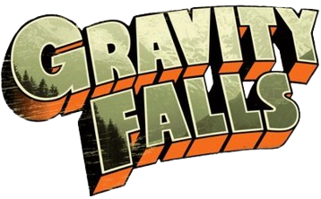
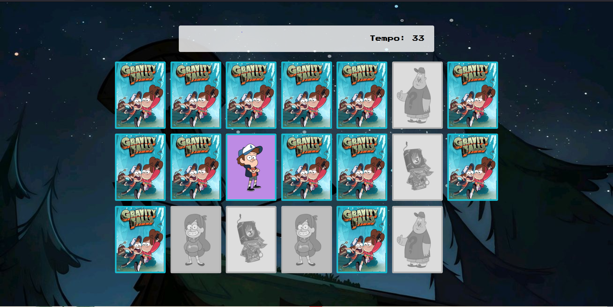

# Jogo da Memória - Gravity Falls 🧠🎮

Bem-vindo(a) ao repositório do **Jogo da Memória de Gravity Falls**! Este projeto foi desenvolvido para praticar e aprimorar minhas habilidades em **HTML**, **CSS** e **JavaScript**, ao mesmo tempo que traz um toque divertido do universo de Gravity Falls. 😊

## 🎯 Objetivos do Jogo

- **Encontrar os pares de cartas**: Cada carta possui uma imagem relacionada à série Gravity Falls, e o objetivo é encontrar os pares correspondentes.
- **Desafiar sua memória**: Quanto mais rápido você encontrar os pares, melhor será seu desempenho.
- **Divertir-se**: Afinal, é um jogo criado para proporcionar entretenimento enquanto praticamos programação!

## 🚀 Tecnologias Utilizadas

- **HTML**: Estrutura do jogo.
- **CSS**: Estilização e animações.
- **JavaScript**: Lógica do jogo, manipulação do DOM e gerenciamento dos pares de cartas.

## 🎓 Propósito

Este projeto foi feito como parte de um processo de **prática e aprendizado**, com o objetivo de aplicar conceitos de front-end em um projeto real. A referência para a criação do jogo veio do canal **Manual Dev** no YouTube, que oferece um excelente conteúdo de tutoriais de programação.

## 👏 Créditos

Inspiração e base de código vieram do tutorial do canal **Manual Dev** no YouTube. Um grande agradecimento a eles por compartilhar esse conteúdo incrível!

## 🔗 Repositório

Você pode conferir o código completo [aqui no GitHub🎮](https://jogo-da-memoria-gih.netlify.app).

Sinta-se à vontade para explorar, fazer sugestões ou mesmo contribuir! 😄

